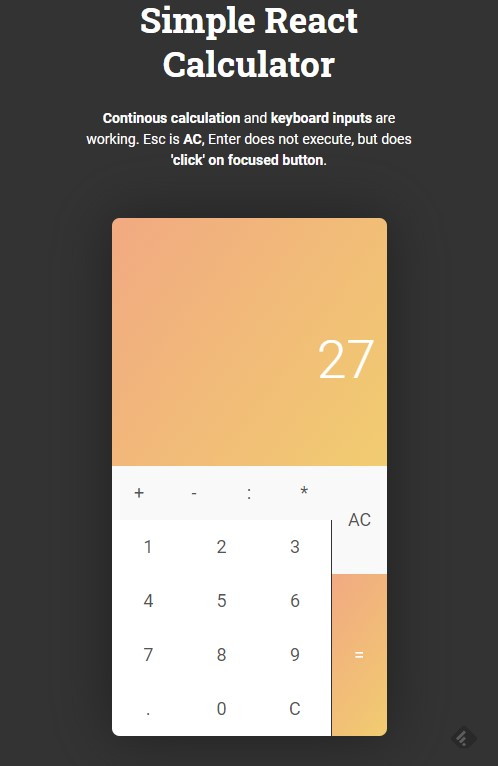

# Simple React Calculator 

This is a [simple react calculator](https://codepen.io/ariksasmita/pen/yqqzZW) copied from codepen. I am trying to see what I need to do in order to make this work in IE11 and IE10. 

## Initial Test 

The app itself works in Chrome. Edge looks good as well, but the buttons are little weird. It has the following problems in IE11. The errors are: 

- SCRIPT1003: Expected ':' 
- SCRIPT1002: Syntax error

I have no clue what these errors are but I am guessing that these are missing javascript features. Here are the initial screenshots: 

### Chrome

### Edge 

### IE 11

## Adding Polyfills 

Needed to add core-js and react-app-polyfill package

npm install core-js 
npm install react-app-polyfill 

and then add before the first imports: 

import 'react-app-polyfill/ie9';
import 'react-app-polyfill/stable';
import 'core-js/stable';

Then restarted the app. This seems to be doing the trick and it works on IE11 just fine: 

### IE 11 working now 
